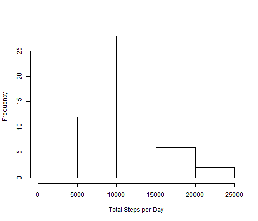
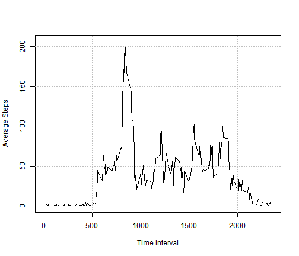
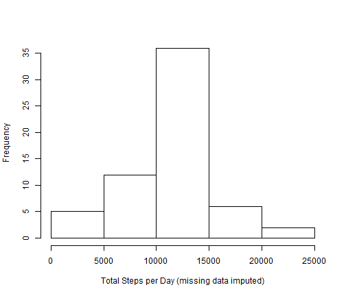
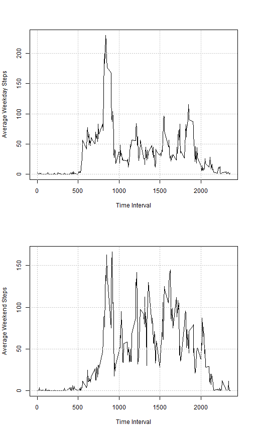

Reproducible Research Assignment 1
========================================================

### Load and transform activity dataset:

```r
#load the data
df <- read.csv("activity.csv", header=TRUE, stringsAsFactors=TRUE)

#find indicies for which steps are not missing data:
x <- which(!is.na(df$steps))

#transform dataset by removing records with missing step data:
y <- df[x,]

#sum steps for each interval for each day for use in histogram:
total.steps<-aggregate(y[,1],by=list(y[,2]),FUN=sum)[,2]
```
### Histogram of total steps per day:

```r
hist(total.steps,xlab="Total Steps per Day", main="")
```

 
### Mean and median of total steps per day

Mean of total steps per day = 10766

Median of total steps per day = 10765

### Calculate 5-minute interval averages across all days:

```r
avg.steps<-aggregate(df[,1],by=list(df[,3]),FUN=function(x){mean(x,na.rm=TRUE)})
names(avg.steps)<-c("interval","avgSteps")
```
### Time Series plot of 5-minute interval averages:

```r
plot(avg.steps,type="l",xlab="Time Interval",ylab="Average Steps")
grid(nx = NULL, ny = NULL, col = "gray", lty = "dotted")
```

 
### 5-minute interval with maximum average:

```r
#find the index that points the maximum value of average steps...
idx <- which(avg.steps$avgSteps==max(avg.steps[,2]))
```
5-minute interval with maximum average: 835

### Imputing missing values
The number of missing values is: 2304.

For each 5-minute interval we will impute a missing value with the interval average.

We will accomplish this by merging the original dataset containing missing values with a dataset of interval averages using the "interval" column as the key. The result of the merge is a new dataset similar to the original except with an extra column holding the average for the interval in each row.

```r
m<-merge(df,round(avg.steps),by="interval")
```
We then find the indexes of the rows that have missing values and replace the missing values with the average value for the interval for that row:

```r
#find the indexes for missing data:
idx2 <- which(is.na(m$steps))
#now replace the missing value with the average for that interval.
m[idx2,2] <- m[idx2,4]

#sum steps for each interval for each day
total.steps.2<-aggregate(m[,2],by=list(m[,3]),FUN=sum)[,2]
```
### Histogram of total steps per day using imputed values:

```r
#plot histogram of total steps per day
hist(total.steps.2,xlab="Total Steps per Day (missing data imputed)", main="")
```

 
### Mean and median of total steps per day using imputed data:

Mean of total steps per day (imputed) = 10766

Median of total steps per day (imputed) = 10762

### Compare weekday step activity with weekend step activity:

First create a factor that indicates whether a date falls on a weekday or weekend:

```r
m$dayType<-ifelse(weekdays(as.Date(m$date)) %in% c("Monday","Tuesday","Wednesday","Thursday","Friday"),"weekday","weekend")
```
Now use the weekday/weekend indicator to average weekend and weekday steps:

```r
#average the steps that occur on weekdays:
avg.weekday.steps<-aggregate(m[m$dayType=="weekday",2],by=list(m[m$dayType=="weekday",1]),FUN=function(x){mean(x,na.rm=TRUE)})

#average the steps that occur on weekends:
avg.weekend.steps<-aggregate(m[m$dayType=="weekend",2],by=list(m[m$dayType=="weekend",1]),FUN=function(x){mean(x,na.rm=TRUE)})
```
### Time series plot comparing weekday and weekend step activity per 5-minute intervals:

```r
layout(1:2)
plot(avg.weekday.steps,type="l",xlab="Time Interval",ylab="Average Weekday Steps")
grid(nx = NULL, ny = NULL, col = "gray", lty = "dotted")
plot(avg.weekend.steps,type="l",xlab="Time Interval",ylab="Average Weekend Steps")
grid(nx = NULL, ny = NULL, col = "gray", lty = "dotted")
```

 

The plots show that during the week most of the step activity is in the morning hours when preparing for work and commuting. The distribution for the weekend is spread out more evenly across the afternoon hours.

